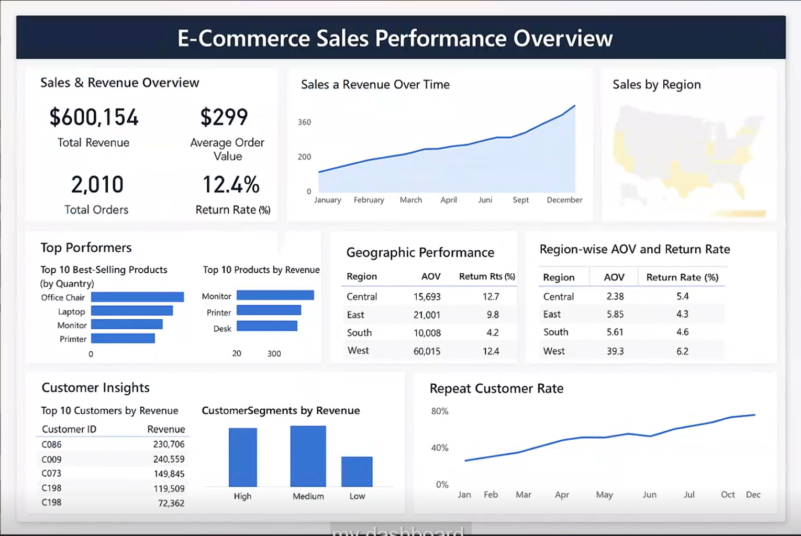

# Ecommerce Analytics Project (SQL)

**Duration:** Oct 2025 – Nov 2025  

This project simulates an ecommerce business data environment to practice analytical queries on real KPIs. It includes 6 relational tables and sample transactions to measure AOV, CLV, retention, and logistics performance.

- Revenue trends, Average Order Value (AOV), Customer Lifetime Value (CLV), and retention.
- Product, region, and customer behavior patterns for segmentation-based decision-making.
- Logistics and returns rate analysis to identify inefficiencies.

## Files

- `CreateTables.sql` – Creates core tables (customers, products, orders, order_details, regions, etc.)
- `Ecommerce.sql` – Main script (schema + data, if applicable)
- `insert_customers.sql` – Sample customer data
- `insert_products.sql` – Sample product data
- `insert_orders.sql` – Orders data
- `insert_order_details.sql` – Line-item data
- `insert_regions.sql` – Region mapping data

## Key Business Questions Answered

### Revenue Insights
- Total revenue over time
- Revenue trend by month/year
- Average Order Value (AOV)
- Top revenue products & categories
- Revenue impact excluding returns

### Customer Insights
- Top customers by spend
- Repeat customer rate
- Average gap between orders
- Segmenting customers (Platinum/Gold/Silver/Bronze)
- Customer Lifetime Value (CLV)

### Product & Returns
- Best selling products by quantity & revenue
- Return rate by product & category
- Customers with frequent returns

### Regional Insights
- Regions by order volume
- Revenue comparison by region
- AOV & order size by region

### Temporal Trends
- Monthly sales trend
- AOV change over time

## How to Use

1. Create a MySQL database (e.g. `ecommerce_analytics`).
2. Run `CreateTables.sql`.
3. Run the insert scripts to populate data.
4. Use your BI tool / SQL client to run analytics queries.

## Dashboard Preview

👉 Full SQL queries available here: [analytics_queries.md](analytics_queries.md)

